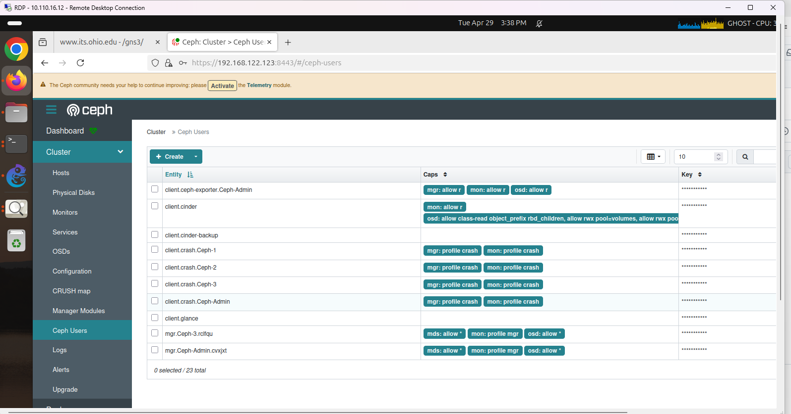
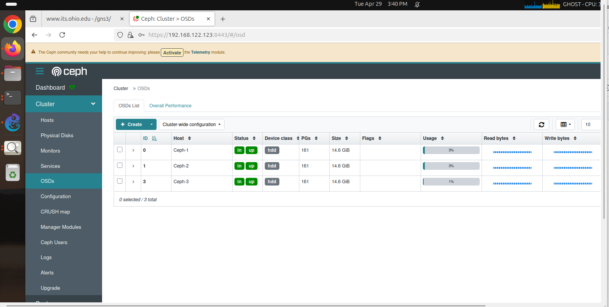
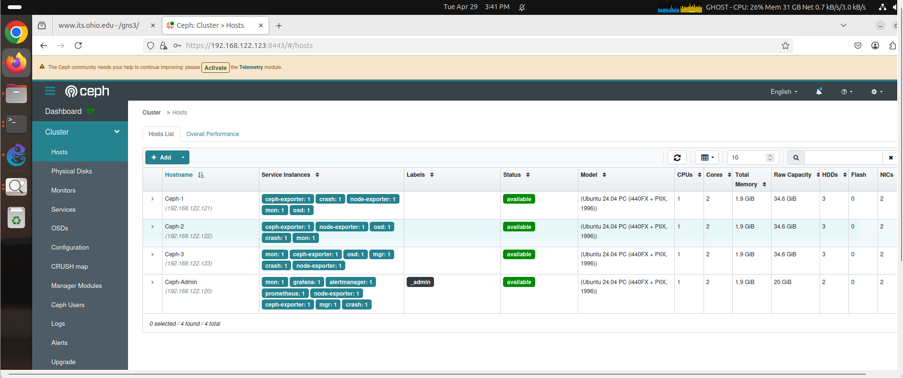
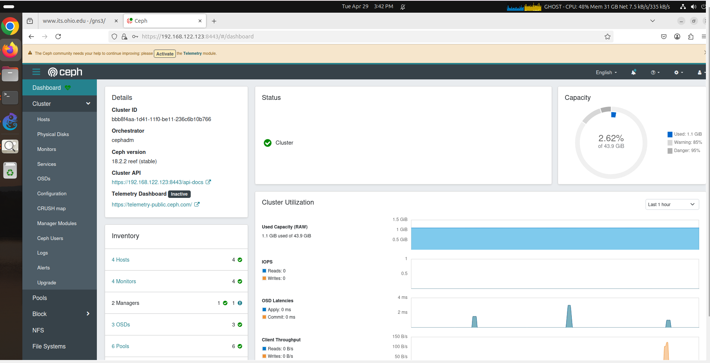
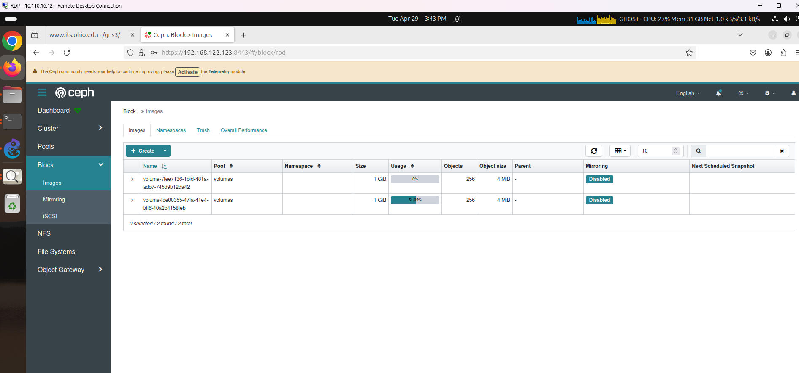

# Dashboard Access

**Since we didn't have a GUI object available to access the Dashboard, I reverse SSH tunneled the traffic to my gHost:**

Run this command on the Ceph-Admin host

```yaml
ssh -R 8443:<deviceruningdashboardIP:8443> itsvm@<gHost IP>
```

Needs to staying running, can be ran in the background if desired 

On gHost, go to http://<deviceruningdashboardIP>:8443
    a.) use the login credentials from bootstrap
    b.) will be prompted to change password after first login

Dashboard Screenshots
[
[
[
[
[


