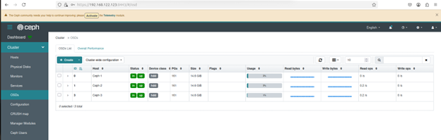
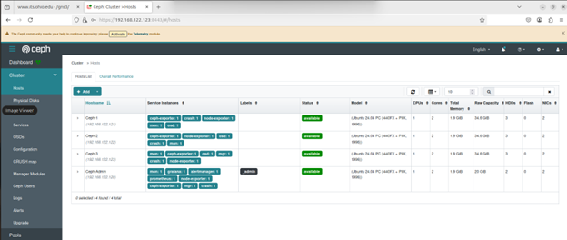
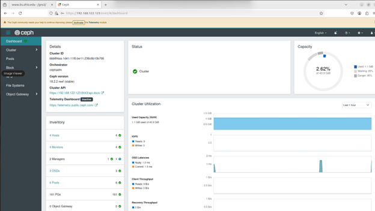

# Dashboard Access

**Since we didn't have a GUI object available to access the Dashboard, I reverse SSH tunneled the traffic to my gHost:**

Run this command on the Ceph-Admin host

```yaml
ssh -R 8443:<deviceruningdashboardIP:8443> itsvm@<gHost IP>
```

Needs to staying running, can be ran in the background if desired 

On gHost, go to http://<deviceruningdashboardIP>:8443
    a.) use the login credentials from bootstrap
    b.) will be prompted to change password after first login

Dashboard Screenshots
[.png)](Picture1(1).png)
[](Picture2.png)
[](Picture3.png)
[](Picture4.png)
[](Picture6.png)
<a href="Picture1(1).png" target="_blank">
  
</a>

<a href="Picture2.png" target="_blank">
  
</a>

<a href="Picture3.png" target="_blank">
  
</a>

<a href="Picture4.png" target="_blank">
  
</a>


<a href="https://raw.githubusercontent.com/mdl365/Cinder-Ceph/main/Picture1%281%29.png" target="_blank">
  
</a>

<a href="https://raw.githubusercontent.com/mdl365/Cinder-Ceph/main/Picture2.png" target="_blank">
  
</a>

<a href="https://raw.githubusercontent.com/mdl365/Cinder-Ceph/main/Picture3.png" target="_blank">
  
</a>

<a href="https://raw.githubusercontent.com/mdl365/Cinder-Ceph/main/Picture4.png" target="_blank">
  
</a>

<a href="https://raw.githubusercontent.com/mdl365/Cinder-Ceph/main/Picture6.png" target="_blank">
  
</a>

[](Dash-1.png)


<a href="Picture6.png" target="_blank">
  
</a>

