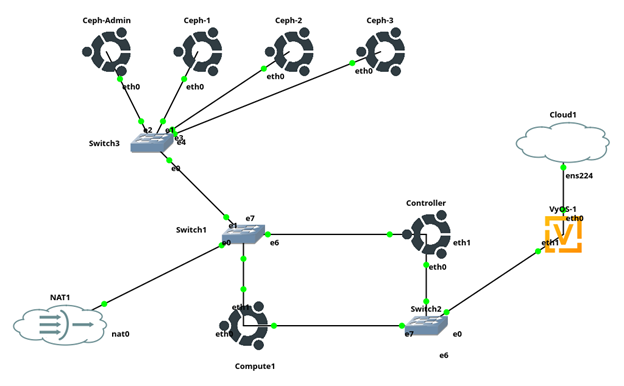

# Lab Overview



In the diagram you see, there is an extra switch from an attempt to deploy an additional storage network for Ceph. One switch will suffice if only adding Ceph to management network. 

Ceph is a scalable, distributed storage system that provides unified access to block, object, and file storage. In our project, we deployed Ceph specifically as a block storage backend for OpenStack Cinder, using RBD (RADOS Block Device) to deliver networked block storage to virtual machines. RBD allows Ceph to present block devices over the network, with built-in replication and fault tolerance. While we only configured block storage for this deployment, Ceph is capable of supporting object storage (via RADOS Gateway) and file storage (via CephFS) if needed in the future.

### **Requirements to be a Ceph Node:**

-Python 3

-Podman or Docker for running containers

-LVM2 for provisioning storage devices

All should be pre-installed except Podman:

### **Docker will work but Podman is preferred by Ceph**

```yaml
sudo apt install podman
```

# **Task 0: Ensure Deployment from Lab 5 is functional**

https://github.com/OHIO-ECT/ITS-4900-SDx-HW-05

These instructions below build on an Openstack environment with a working Controller and Compute node, that can deploy VMs

# **Task 1: Deploy Ceph-Admin Node and Bootstrap**

https://docs.ceph.com/en/reef/cephadm/install/#cephadm-deploying-new-cluster 

1.  Add a new Ubuntu-22-CLI object in GNS3, this will be our admin node

2.  Connect switch to Admin Node, configure that node with Management Network IP

*Optional: If using a storage network for Ceph, also make sure the admin node has an IP in that subnet*

### Installing Cephadm (on admin node)
3. Install cephadm on the admin node:

```yaml
apt install -y cephadm
```

If not able to use apt install, can also use curl:
 
**Skip to Step 6 if not using curl**

*Note: If installing manually, use version 18.2.2 (latest version that has support for our CPU instruction sets (x86-64-v1))*

CEPH_RELEASE=replace this with the active release version (18.2.2 for our lab) (https://docs.ceph.com/en/latest/releases/#active-releases)

```yaml
curl --silent --remote-name --location https://download.ceph.com/rpm-$<CEPH_RELEASE>/el9/noarch/cephadm
```

4.  Make sure that the file is executable and can be run from current directory

```yaml 
chmod +x cephadm
```

5.  Install the Cephadm command 

```yaml
./cephadm add-repo --release reef
```
```yaml
./cephadm install
```

6.  Confirm Install with 

```yaml
which cephadm
```

should output "/usr/sbin/cephadm"


# Task 2: Bootstrap a New Cluster

*This command creates an MON/MGR/dashboard on admin node*

*Note:* mon-ip= address in management network 

--cluster-network option used if deploying seperate storage network

    *--cluster-network <private(storage) address>*

This commmand forces Ceph to use version 18.2.2 and avoids the issues with AppArmor Ubuntu security package

7.  Bootstrap the Admin Node, change --mon-ip to match your deployment 
```yaml
CEPHADM_IMAGE=quay.io/ceph/ceph:v18.2.2 cephadm bootstrap --mon-ip 192.168.122.xxx 
```
***IMPORTANT*: If configuring dashboard, note default username and password are given in the output of the bootstrap command above, keep these for later**

At this point: Cephadm takes over alot and automates behind the scene configurations
	
Most Importantly: 

   a. Creates monitor and manager daemon on node

   b. Adds SSH key for Ceph cluster to root user's file


# Task 3.) Using Ceph Containers

There are two ways to run commands with Ceph, inside a container with the Ceph packages or with the Ceph-common repo to run from command line directly

8.  To access the container with commands, Run: 
```yaml
cephadm shell -- ceph <whatever command>
```
### *Optional but Recommended:* allows you run commands without needing to run 'cephadm shell --' first

9.  Install Ceph-common: 
```yaml
cephadm add-repo --release quincy
```
```yaml
cephadm install ceph-common
```
10.  Confirm Install with: (Run from wherever in command line, no need to run cephadm shell container first)

```yaml
ceph -v
```

11.  Check Cluster Connection and Status

```yaml
ceph status
```
# Task 4.) Preparing Ubuntu-22 to be a Ceph OSD

Host OSDs must not have partitions, a filesystem, LVM state, and cannot be mounted. There must also be more than 5 GB available on the device. 

Ceph recommends a minimum of 3 object storage devices (OSDs). Deploy 3 additional Ubuntu-22-CLI objects and connect them to the switch 

***IMPORTANT: Before Starting Device:***

12. In GNS3, right click and hit configure object, once the screen opens, click the HDD tab at the top. 

13. Navigated down to HDB, hit create
    
    i.) select Qcow2 on first screen, hit next
    
    ii.) Hit next on second screen, no changes
    
    iii.) Configure disk size to your liking (must be bigger than 5 GB) and hit finish

14.  Boot/Reboot the Ubuntu-22 at this time, make sure you see the disk you intended to use 
```yaml
sudo fdisk -l
```
15.  If you used HDB like me, follow these commands: If not, replace *dev/vdb* with the name of the disk you used
```yaml
sudo wipefs --af /dev/vdb
sudo pvremove /dev/vdb || true
sudo dd if=/dev/zero of=/dev/vdb bs=1M count=10
```
This wipes the filesystem, clears out LVM, and clears out the first 10 MBs of data to be safe. The storage device is now a raw block device that can be used. 

### 16.  Repeat as neccesary for other OSD nodes. *(Minimum= 3 OSD nodes)*

# Task 5: Connect OSDs

*We deployed monitor and manager on the admin node, all remaining nodes will need be OSDs in our setup*

Ceph needs passwordless sudo access on the Ceph Cluster hosts, to enable: 

17.  **On node to be OSD**, to allow root login, run:

```yaml
sudo sed -i 's/#PermitRootLogin prohibit-password/PermitRootLogin yes/' /etc/ssh/sshd_config
sudo systemctl restart ssh
sudo passwd root
```

18.  When prompted: set the root password to the standard itsclass's password

19.  **On Ceph-Admin run:**
```yaml
ssh-copy-id -f -i /etc/ceph/ceph.pub root@<target OSD IP>
```

20.  **Back on node to be OSD:** 
```yaml 
sudo sed -i 's/^PermitRootLogin yes/PermitRootLogin prohibit-password/' /etc/ssh/sshd_config
sudo systemctl restart ssh
```
*This is just for security, only allows key-based authentication to root user after initial SSH setup*

21.  **Back to Ceph-Admin,** run the following to add host:

hostname= Ubuntu-22 hostname

host IP= Ubuntu-22 management network IP
    
```yaml
ceph orch host add <hostname> <host IP address>
```
### 22. Repeat as Neccesary for all OSD nodes to be deployed.

# If need to delete host: 
```yaml
ceph orch host drain <hostname>
```
# Task 6: Deploy OSDs

With Ubuntu-OSD disk cleared and host added, the node can now be configured as an OSD

23.  To Configure Individually (recommended): 
```yaml
ceph orch daemon add osd <host>:<device-path>
```
    ex.) ceph orch daemon add osd Ceph-1:/dev/vdb

Repeat this command for all OSD nodes and storage devices on those nodes

24. You can also tell Ceph to consume all unused devices, this does take longer and eat up compute (recommend individually adding hosts)

```yaml
ceph orch apply osd --all-available-devices
```

24.  Run this to verify OSDs are available and check cluster health
```yaml
ceph -s
```

# Task 7: Integrate Cinder and Ceph

# Task 8: Deploy an OpenStack object with Ceph backend storage


